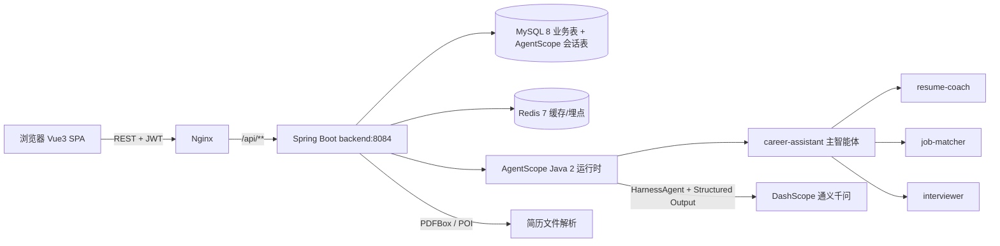
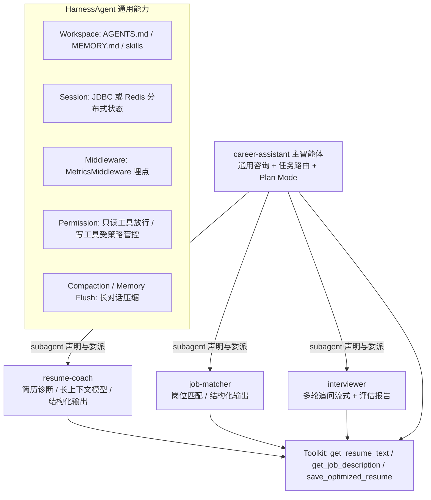
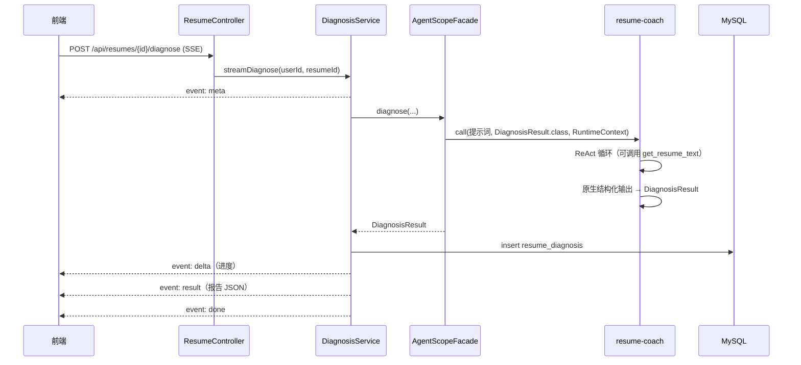
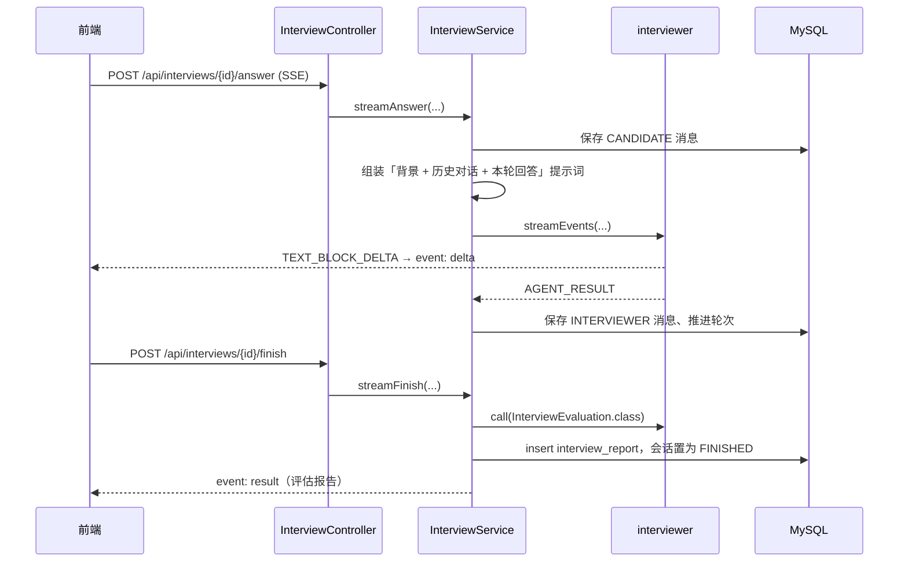
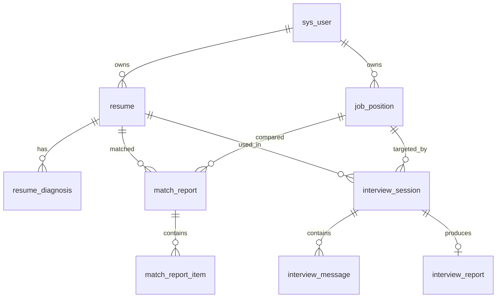

# 求职智能助手 · 系统计划书 V1

> 定位：面试作品 / 个人练手项目，重点展示 AgentScope Java 2 的多智能体工程能力。
> 技术底座：JDK 17 + Spring Boot 3.5.16 + AgentScope Java 2.0.3 + MySQL 8 + Redis 7 + Vue 3 + Element Plus。
> 文档版本：V1。
>
> **阅读须知**：本文档是完整设计蓝图。仓库当前**只保留底层框架骨架**（统一响应与异常、JWT 鉴权、
> MyBatis-Plus、Redis 工具、文件存储、SSE 推送、AgentScope 模型与会话装配、Agent 构建工厂、
> 前端脚手架），第 2 章及以后的业务功能（简历诊断 / 岗位匹配 / 模拟面试）属于待实现范围，
> 按第 11 章的里程碑推进即可。

---

## 1. 项目背景与目标

### 1.1 背景

求职准备存在三个高频痛点：

1. **简历不知道差在哪**：候选人只能得到「再优化一下」这类空泛反馈，缺少维度化打分与可直接抄改的示例。
2. **不知道岗位能不能投**：JD 与简历的差距靠感觉判断，缺少命中/缺失关键词与补齐路径。
3. **缺少低成本面试演练**：真人模拟面试成本高，而通用大模型问答又缺少「追问—点评—评分」的面试结构。

### 1.2 项目目标

用 AgentScope Java 2 构建一个**多智能体协作**的求职助手，做到：

- **可解释**：所有评分都拆到维度，并给出对应证据（引用简历 / JD 原文）。
- **可执行**：建议统一采用「问题 → 改法 → 示例」结构，示例可直接用于改简历。
- **可复现**：一条命令启动，Mock 模式离线可演示，DashScope 模式接入真实模型。
- **可讲解**：架构完整覆盖 AgentScope Java 2 的核心概念（ReAct、Tool、Middleware、Permission、Workspace、Subagent、Session、Event Stream），支撑面试答辩。

### 1.3 非目标（v1 明确不做）

- 不做招聘网站爬取（合规风险），JD 由用户粘贴或上传。
- 不做实时语音面试（ASR + TTS 全链路），只做文字多轮对话。
- 不做独立管理后台（题库 / Prompt 运营页）。
- 不导出 PDF 报告，报告以 Markdown 在线展示与复制。
- 不使用 Sandbox 沙箱与 A2A 协议（作为后续演进项保留）。

---

## 2. 需求范围与用户故事

### 2.1 角色

只有一个角色：**求职者**（注册用户）。所有数据按 `user_id` 隔离。

### 2.2 三大主线与用户故事

| 主线 | 用户故事 | 产出 |
| --- | --- | --- |
| 简历诊断 | 作为求职者，我上传/粘贴简历后，希望知道简历分数和问题所在，并能直接抄改 | 综合得分、≥4 个维度评分、问题清单、亮点、优化建议、优化后简历正文 |
| 岗位匹配 | 作为求职者，我把目标 JD 贴进来，希望知道匹配度与差在哪 | 匹配度、4 个维度评分、命中/缺失关键词、差距补齐建议 |
| 模拟面试 | 作为求职者，我想按目标岗位练一场面试，并知道答得好不好 | 多轮问答记录（含追问与点评）、5 个维度评估、亮点/不足、下一轮准备清单、参考回答 |

### 2.3 支撑功能

- 账号：注册 / 登录 / 当前用户（JWT 无状态鉴权）。
- 简历管理：上传（PDF / DOC / DOCX / TXT / MD）→ 自动解析 → 结构化；在线编辑 / 粘贴；设为默认简历；逻辑删除。
- 岗位管理：粘贴 JD 保存为岗位；列表与删除。
- 通用助手：自由问答，主智能体按需委派给三个专业子智能体。
- 工作台：简历 / 岗位 / 诊断 / 匹配 / 面试数量概览。

### 2.4 验收标准（可测）

1. 上传简历后 `parse_status=SUCCESS`，可查看解析后的字符数与预览。
2. 诊断报告 `dimensions.size() >= 4`，且 `overall_score ∈ (0,100]`。
3. 匹配报告 4 个维度齐全，且命中、缺失关键词各至少 1 个。
4. 面试会话按 `plan_rounds` 推进，结束后生成 5 个维度的评估报告。
5. `mvn test` 在**无 MySQL / 无 Redis / 无 API Key** 的环境下全部通过。
6. 任何一次智能体异常，前端收到 `error` 事件并展示明确提示，而不是静默失败。

---

## 3. 技术选型与版本表

| 组件 | 版本 | 选型理由 |
| --- | --- | --- |
| JDK | 17（Dragonwell 17.0.18） | AgentScope Java 2 要求 JDK 17+；与既有项目一致 |
| Maven | 3.9.16（wrapper 固定 3.9.11） | `maven-enforcer-plugin` 在 `validate` 阶段强制 JDK [17,18) 与 Maven ≥3.9.11 |
| Spring Boot | 3.5.16 | 与既有项目基线一致，MyBatis-Plus / Knife4j 生态成熟 |
| AgentScope Java | 2.0.3 | 核心运行时 + Harness + DashScope 模型 + JDBC/Redis 会话存储 |
| MyBatis-Plus | 3.5.17（spring-boot3-starter + jsqlparser） | 分页插件自 3.5.17 起独立成模块 |
| MySQL | 8.0 | 业务数据与 AgentScope 会话状态持久化 |
| Redis | 7.4 | 热会话、限流、智能体埋点统计 |
| JWT | jjwt 0.11.2 | 与既有项目一致的无状态鉴权实现 |
| 接口文档 | Knife4j 4.5.0 | `/doc.html`，中文界面 |
| 简历解析 | PDFBox 3.0.8 + POI 5.5.1 | PDF / DOCX 文本抽取 |
| 工具库 | Hutool 5.8.47、Lombok 1.18.46 | JSON、BCrypt、字符串处理 |
| 前端 | Vue 3.5 + Vite 6 + TS 5.7 + Element Plus 2.9 + Pinia + vue-router 4 + axios + ECharts 5 + markdown-it + DOMPurify | 与既有前端习惯一致；ECharts 画雷达图，markdown-it + DOMPurify 安全渲染模型输出 |
| 部署 | Docker Compose（MySQL/Redis）+ `java -jar` + Nginx | 与既有项目部署方式一致 |

### 3.1 三个关键选型决策

**决策一：不使用 `agentscope-spring-boot-starter` 的自动配置。**

原因：该 starter 编译基线为 Spring Boot 4.0.1，且只提供 3 个 Bean（`Memory`、`Toolkit`、单个 `ReActAgent`），
无法表达本项目的「1 主 + 3 子」结构。项目改为自建 `AgentScopeConfig` 显式装配模型、工具集、会话存储、
中间件与四个 `HarnessAgent`，每个 Bean 的职责都可在答辩时逐条解释。

**决策二：会话存储使用 `agentscope-extensions-jdbc` / `agentscope-extensions-redis`（2.0.3）。**

原因：`agentscope-extensions-session-mysql` / `session-redis` 停留在 2.0.0-RC1，与 2.0.3 核心存在版本错配风险；
而 2.0.3 的 `JdbcDistributedStore` 会**自动探测方言并初始化表结构**，对 MySQL 友好。
`app.agent.session-store` 支持 `mysql`（默认，跨实例可恢复）/ `redis`（热会话）/ `memory`（本地调试）三种模式切换。

**决策三：业务接口不依赖「模型自由编排」，而是「专用智能体 + 结构化输出」。**

诊断、匹配、评估三类结果需要入库并展示，必须结构稳定。因此：

- 诊断 / 匹配 / 面试评估 → `agent.call(msgs, XxxResult.class, ctx)`，由 AgentScope 原生结构化输出保证 JSON 结构；
- 面试对话 / 通用助手 → `agent.streamEvents(...)`，逐 token 推送，保证交互体验；
- 主助手 `career-assistant` 另外声明三个子智能体，演示 `agent_spawn` / `agent_send` 编排与事件转发。

---

## 4. 系统架构

### 4.1 总体架构



### 4.2 后端分层

```
com.wxy.career
├─ common（独立 Maven 模块）：Result / 异常 / JWT / 拦截器 / MyBatis-Plus / RedisUtil
├─ config        AgentProperties、StorageProperties、AgentScopeConfig、WebMvcConfig、Knife4jConfig
├─ auth          注册、登录、当前用户
├─ user          sys_user 实体与 Mapper
├─ resume        简历 CRUD、上传解析、诊断报告（DiagnosisService）
├─ job           岗位 JD 管理
├─ match         岗位匹配报告 + 维度明细
├─ interview     面试会话、对话、评估报告
├─ assistant     通用助手对话
├─ overview      工作台概览
├─ agent         AgentFacade（dashscope / mock 双实现）、AgentEventMapper、工具集、埋点中间件、提示词
└─ infra         FileStorage（本地磁盘，预留 MinIO）、SseEmitterSupport
```

### 4.3 Agent 架构



### 4.4 一次简历诊断的时序



### 4.5 一次面试轮次的时序



---

## 5. 数据模型

### 5.1 ER 关系



### 5.2 表清单

| 表 | 用途 | 关键字段 |
| --- | --- | --- |
| `sys_user` | 账号 | username(唯一)、password(BCrypt)、nickname、status |
| `resume` | 简历 | user_id、title、source_type、file_path、raw_text、structured_json、parse_status、is_default |
| `resume_diagnosis` | 诊断报告 | resume_id、overall_score、radar_json、issues_json、highlights_md、suggestions_md、optimized_resume_md |
| `job_position` | 岗位 JD | user_id、job_title、company_name、city、salary_range、jd_text |
| `match_report` | 匹配报告 | resume_id、job_id、overall_score、matched_keywords、missing_keywords、summary_md、suggestions_md |
| `match_report_item` | 匹配维度明细 | report_id、dimension、score、comment、sort_no |
| `interview_session` | 面试会话 | plan_rounds、finished_rounds、status、total_score、agent_session_id |
| `interview_message` | 面试对话 | session_id、role、content、question_type、round_no、seq_no |
| `interview_report` | 评估报告 | session_id、overall_score、dimension_json、strengths_md、weaknesses_md、suggestions_md、reference_answers_md |

约定：

- 主键统一自增 `BIGINT`；`is_delete` 逻辑删除（MyBatis-Plus 全局配置）；`create_time` / `update_time` 由 `MetaObjectHandler` 填充。
- 评分维度、问题清单存 JSON 列（`radar_json` / `issues_json` / `dimension_json`），便于前端直接渲染；匹配维度因需要按维度查询与排序，独立成 `match_report_item` 表。
- **AgentScope 会话状态表**由 `agentscope-extensions-jdbc` 首次访问时自动创建，与业务表共库但互不依赖。

完整 DDL 见 `sql/career_assistant.sql`。

---

## 6. 接口与 SSE 事件协议

### 6.1 REST 接口

| 接口 | 方法 | 说明 |
| --- | --- | --- |
| `/api/auth/register` | POST | 注册并返回 Token |
| `/api/auth/login` | POST | 登录 |
| `/api/auth/me` | GET | 当前用户 |
| `/api/resumes/upload` | POST multipart | 上传简历文件并解析 |
| `/api/resumes/manual` | POST | 在线填写 / 粘贴简历 |
| `/api/resumes` | GET | 简历列表 |
| `/api/resumes/{id}` | GET / PUT / DELETE | 详情 / 修改 / 删除 |
| `/api/resumes/{id}/diagnose` | POST SSE | 简历诊断 |
| `/api/resumes/{id}/diagnoses` | GET | 历史诊断报告 |
| `/api/jobs` | POST / GET | 新增 / 列表 |
| `/api/jobs/{id}` | DELETE | 删除岗位 |
| `/api/matches/stream` | POST SSE | 岗位匹配 |
| `/api/matches` | POST / GET | 同步匹配（调试）/ 历史报告 |
| `/api/interviews` | POST / GET | 创建会话（返回首题）/ 列表 |
| `/api/interviews/{id}` | GET | 会话详情 |
| `/api/interviews/{id}/messages` | GET | 对话记录 |
| `/api/interviews/{id}/answer` | POST SSE | 作答并流式返回点评 / 下一题 |
| `/api/interviews/{id}/finish` | POST SSE | 生成评估报告 |
| `/api/interviews/{id}/report` | GET | 评估报告 |
| `/api/assistant/chat` | POST SSE | 通用助手对话 |
| `/api/overview` | GET | 工作台概览 |
| `/actuator/health`、`/doc.html` | GET | 健康检查与接口文档 |

响应体统一为 `Result{code,msg,data}`：HTTP 恒为 200，`code=200` 成功，
`202` 参数错误，`203` 未登录，`204` 无权限，`205` 不存在，`206` 解析失败，`207` 智能体失败，`500` 系统异常。

### 6.2 SSE 事件协议

事件名与顺序固定，前端按事件名分流处理：

| 事件 | data 结构 | 说明 |
| --- | --- | --- |
| `meta` | `{scene, provider, ...}` | 流开始，携带场景与业务 ID |
| `delta` | `{content}` | 文本增量（模型逐 token 输出） |
| `thinking` | `{content}` | 思考增量（模型支持思维链时） |
| `tool` | `{name, status, detail}` | 工具调用开始 / 结束 |
| `node` | `{name}` | 子智能体被触发（`SUBAGENT_EXPOSED` 映射） |
| `result` | `{data}` | 最终结构化结果（诊断 / 匹配 / 报告 / 完整回答） |
| `done` | `{}` | 流正常结束 |
| `error` | `{message}` | 异常，前端展示并结束 loading |

后端映射逻辑集中在 `AgentEventMapper`：`TEXT_BLOCK_DELTA → delta`、`TOOL_CALL_START → tool`、
`SUBAGENT_EXPOSED → node`、`AGENT_RESULT → result`，其余事件忽略，避免协议噪声。

---

## 7. 前端页面与交互

| 路由 | 页面 | 关键交互 |
| --- | --- | --- |
| `/login` | 登录 / 注册 | Tab 切换，成功后写入 localStorage Token |
| `/dashboard` | 工作台 | 概览卡片 + 三大能力入口 |
| `/resumes` | 简历管理 | 上传 / 在线编辑 / 删除 / 「开始诊断」流式进度 |
| `/resumes/:id/diagnosis` | 诊断报告 | 仪表盘得分 + ECharts 雷达图 + 问题时间线 + Markdown 建议 + 优化稿折叠 |
| `/jobs` | 岗位匹配 | 左侧岗位列表 + 右侧报告（雷达图、命中/缺失关键词标签、结论与建议） |
| `/interviews` | 面试列表 / 新建 | 选简历 + JD + 难度 + 轮数，创建后进入面试房间 |
| `/interviews/:id/room` | 面试房间 | 聊天气泡、打字机流式渲染、轮次进度、结束并生成报告 |
| `/interviews/:id/report` | 面试评估 | 得分、雷达图、亮点 / 不足 / 准备清单 / 参考回答 |
| `/assistant` | 通用助手 | 流式对话，收到 `node` 事件时提示「已委派给子智能体」 |

关键实现点：

- **SSE 客户端**：`src/api/sse.ts` 用 `fetch + ReadableStream` 手工解析 `event:` / `data:` 行。
  之所以不用 `EventSource`：它不支持 POST，也无法附带 `Authorization` 头。
- **Markdown 渲染**：`markdown-it` 渲染 + `DOMPurify` 清洗，防止模型输出注入脚本。
- **图表**：`ScoreRadar.vue` 封装 ECharts 雷达图，props 变化即重绘，窗口 resize 自适应。
- **类型对齐**：`src/types/index.ts` 与后端 VO 一一对应，减少联调成本。

---

## 8. Agent 角色与提示词策略

### 8.1 角色分工

| 智能体 | 模型 | 输出方式 | 提示词文件 |
| --- | --- | --- | --- |
| `career-assistant`（主） | qwen-plus | 流式文本 + 子智能体委派 | `agents/career-assistant.md` |
| `resume-coach` | qwen-max（长上下文） | `DiagnosisResult` 结构化输出 | `agents/resume-coach.md` |
| `job-matcher` | qwen-max | `MatchResult` 结构化输出 | `agents/job-matcher.md` |
| `interviewer` | qwen-plus | 对话流式 + `InterviewEvaluation` 结构化 | `agents/interviewer.md` |

### 8.2 提示词工程策略

1. **角色 + 评分口径前置**：System Prompt 先定义角色与评分维度，再定义输出要求。
2. **结构化输出约束**：明确「严格按 JSON Schema 返回，不要输出多余解释」，便于 `getStructuredData()` 反序列化。
3. **证据绑定**：要求评语引用简历 / JD 原文，避免「作文式」空泛评价。
4. **反编造红线**：不得编造经历与数据，无法确认的信息用 `【待补充：xxx】` 占位。
5. **上下文预算**：简历截断 6000 字符、JD 截断 4000 字符后再入提示词；超出部分由工具 `get_resume_text` / `get_job_description` 按需读取，减少 token 消耗。
6. **面试轮次控制**：把「计划轮数 / 当前轮次」写进提示词，最后一轮要求先点评再收尾，保证对话有始有终。

### 8.3 记忆与状态

- **短期记忆**：每轮把历史对话（`interview_message`）重新组织进提示词。AgentScope 2.0 的智能体是无状态的，这样既保证多轮上下文，也便于水平扩展。
- **长期记忆**：Harness 的 Workspace（`AGENTS.md` + `MEMORY.md` + `memory/`）保存用户稳定偏好（目标岗位、城市、技术栈）。
- **会话持久化**：`RuntimeContext(userId, sessionId)` 绑定会话，状态由 `JdbcDistributedStore`（默认）或 Redis 存储，支持跨实例恢复。
- **上下文压缩**：长对话依赖 Harness 的 Compaction / Memory Flush，压缩前把关键信息写入长期记忆。

### 8.4 工具与权限

| 工具 | 类型 | 作用 |
| --- | --- | --- |
| `get_resume_text` | 只读 | 按 ID 读取简历全文（≤8000 字符） |
| `get_job_description` | 只读 | 按 ID 读取岗位 JD |
| `save_optimized_resume` | 写 | 把优化稿写回最近一次诊断报告，演示 Permission System |

只读工具在 `PermissionMode.EXPLORE / ACCEPT_EDITS` 下自动放行；写工具受 `app.agent.permission-mode` 管控，
当策略要求确认时，AgentScope 会发出 `REQUIRE_USER_CONFIRM` 事件（前端可扩展为弹窗确认）。

---

## 9. 部署方案（Linux + Nginx）

### 9.1 拓扑

```
用户浏览器
   | 80
   v
Nginx -- 静态资源：/opt/career-assistant/frontend/dist
   | /api/** 反向代理（关闭 buffering，300s 超时）
   v
backend 8084（java -jar，prod profile）
   |-- MySQL 8：业务表 + AgentScope 会话表
   `-- Redis 7：热会话 / 埋点计数
        （Docker Compose 托管，见 deploy/docker-compose.yml）
```

### 9.2 步骤

```bash
cp deploy/.env.example deploy/.env
docker compose -f deploy/docker-compose.yml up -d      # MySQL 首次启动自动执行 sql/career_assistant.sql
./mvnw clean package -DskipTests
cd frontend && npm install && npm run build && cd ..
export DASHSCOPE_API_KEY=sk-xxx JWT_SECRET=$(openssl rand -hex 32)
./deploy/start-backend.sh
sudo cp deploy/nginx.conf /etc/nginx/conf.d/career-assistant.conf && sudo nginx -t && sudo systemctl reload nginx
```

### 9.3 配置分层

| 文件 | 内容 | 是否入库 |
| --- | --- | --- |
| `application.yml` | 与环境无关：端口、MyBatis-Plus、Knife4j、agent 默认参数 | 是 |
| `application-local.yml` | 本机 / 服务器地址与 Key（全部支持环境变量覆盖） | 是（不含真实密钥） |
| `application-prod.yml` | 生产必填环境变量、关闭 Knife4j、日志降噪 | 是 |
| `application-local.local.yml` | 个人私有覆盖 | 否（被 .gitignore 忽略） |
| `src/test/resources/application-test.yml` | H2 + Mock 模型 | 是 |

必须注入的环境变量：`DASHSCOPE_API_KEY`、`JWT_SECRET`；可选：`MYSQL_*`、`REDIS_*`、`AGENT_PROVIDER`、`AGENT_SESSION_STORE`。

### 9.4 SSE 部署注意事项

- Nginx 必须 `proxy_buffering off`，否则流式会退化成一次性返回。
- `proxy_read_timeout` ≥ 300s，与后端 `spring.mvc.async.request-timeout` 对齐。
- 前后端同域部署（Nginx 同时托管静态资源与代理 API），避免跨域与鉴权头丢失。

---

## 10. 测试与验收

### 10.1 骨架自带测试（10 个，全部通过）

| 测试 | 覆盖点 |
| --- | --- |
| `JwtTokenServiceTest` | Token 签发 / 解析 / 篡改拒绝 / Bearer 前缀剥离 |
| `ResumeParserTest` | 扩展名路由、纯文本解析、不支持类型报错 |
| `AgentEventMapperTest` | AgentScope 事件 → SSE 事件 的映射契约 |
| `CareerAssistantApplicationTests` | Mock 模式 + H2 下上下文可正常启动 |
| `AgentFrameworkWiringTest` | 用 dummy Key 真实构建模型与示例 Agent（不调用模型、不联网），并校验工具集为空 |

> 业务测试（诊断 / 匹配 / 面试链路）属于待实现范围，随业务代码一并补充。

### 10.2 分层测试策略

```
单元测试    解析器 / JWT / 事件映射 / Mock 门面            <- mvn test 全绿，可进 CI
集成测试    @SpringBootTest + test profile（H2 + Mock）    <- 覆盖 Service 与 Controller 装配
人工验收    真实 DashScope Key + MySQL + Redis             <- 三条主线 + 前端流式渲染
```

### 10.3 人工验收清单

1. `AGENT_PROVIDER=mock` 启动，无需任何外部依赖即可跑通全流程（面试演示的保底方案）。
2. 切换 `dashscope` + 真实 Key，上传一份真实 PDF 简历，确认诊断报告包含真实证据引用。
3. 用同一份简历与两个不同 JD 分别匹配，确认缺失关键词随 JD 变化。
4. 完成一场 3 轮面试，确认报告中的 strengths / weaknesses 引用了具体回答。
5. 断开 Redis，确认接口仍可用（埋点降级不阻断主流程）。
6. 不配置 API Key 启动 `dashscope` 模式，确认启动即报出明确错误，而不是运行期空指针。

---

## 11. 里程碑（M1–M7 与仓库实现对应）

| 里程碑 | 内容 | 状态 |
| --- | --- | --- |
| M1 计划书与骨架 | 本计划书、Maven 聚合工程、前端脚手架、SQL、Docker Compose、Maven Wrapper | 骨架已提供 |
| M2 用户与基础设施 | 注册登录 JWT、MyBatis-Plus、Redis 工具、统一 Result/异常、文件存储抽象 | 骨架已提供 |
| M3 简历与 JD | PDF/DOCX/TXT 解析、在线编辑、JD 录入 | 待实现 |
| M4 Agent 内核 | AgentScope 装配（模型 / Workspace / Session / Toolkit / Middleware / Permission）、1 主 3 子、SSE 事件流 | 装配层已提供，业务 Agent 待实现 |
| M5 三大业务 | 简历诊断、岗位匹配、模拟面试与评估报告的前后端全链路 | 待实现 |
| M6 通用助手与工作台 | 主智能体路由、概览统计、历史报告列表 | 待实现 |
| M7 测试与部署 | 自动化测试、Linux 部署脚本与 Nginx 配置、README | 测试与部署骨架已提供 |

后续演进（v2 备选）：

1. 报告导出 PDF / Word。
2. 面试语音链路（TTS 朗读题目，可选 ASR 作答）。
3. 简历与 JD 的向量化检索（RAG）与岗位库预置。
4. Sandbox 沙箱执行代码题；A2A 协议对接外部面试官 Agent。
5. 管理后台：Prompt 模板版本管理、调用成本与效果看板。

---

## 12. 风险与对策

| 风险 | 影响 | 对策 |
| --- | --- | --- |
| AgentScope starter 与 Spring Boot 4.0.1 绑定 | 依赖冲突 | 不使用其自动配置，自建 `AgentScopeConfig`（已验证在 Boot 3.5.16 下编译运行） |
| 扩展模块版本错配（session-* 停留在 2.0.0-RC1） | 运行期不兼容 | 改用 2.0.3 的 `agentscope-extensions-jdbc` / `-redis` |
| 模型返回非法 JSON | 报告无法入库 | 原生结构化输出（JSON Schema）+ `getStructuredData`，失败即抛业务异常并返回 `error` 事件 |
| 结构化输出与流式体验冲突 | 无法既打字又拿结构化结果 | 按场景分工：需要入库用 `call + structured`，需要交互用 `streamEvents` |
| 长简历 / 长对话超出上下文 | 调用失败或成本升高 | 输入截断 + 工具按需读取 + Harness Compaction / Memory Flush |
| 模型调用耗时导致 SSE 超时 | 前端卡住 | 前端 axios 180s、SSE 5 分钟；后端 `timeout()` 兜底并返回 `error` 事件 |
| Redis 不可用 | 埋点失败拖垮主流程 | `MetricsMiddleware` 全部 try/catch 降级，只打日志 |
| 无 API Key 导致无法演示 | 现场翻车 | `app.agent.provider=mock` 离线模式，接口与页面完全一致 |
| Nginx 缓冲导致「假流式」 | 体验退化 | `proxy_buffering off` + `chunked_transfer_encoding on`（已写入 nginx.conf） |
| 上传文件安全 | 目录穿越 / 超大文件 | 文件名 UUID 化、路径 normalize + 前缀校验、扩展名白名单、multipart 10MB 限制 |

---

## 13. 面试讲解要点（对齐 AgentScope Java 2 考点）

| 考点 | 本项目中的落点 | 一句话讲法 |
| --- | --- | --- |
| ReAct 循环 | 四个 `HarnessAgent` 的推理-行动循环；诊断可调用 `get_resume_text` 补读原文 | 「模型先推理要什么信息，再决定调不调工具，工具结果回到上下文继续推理，直到能给出结构化答案」 |
| Msg / Model / Toolkit | `UserMessage` 入参、`DashScopeChatModel`、`Toolkit.registerTool` | 「消息是上下文载体，模型是推理引擎，工具集是可被调用的能力清单」 |
| ReActAgent vs HarnessAgent | 直接使用 `HarnessAgent` | 「HarnessAgent = ReActAgent + 工作区 + 记忆 + 子智能体 + 权限 + 压缩等工程能力」 |
| Middleware / Hook | `MetricsMiddleware` 拦截 `onModelCall` / `onActing` 统计耗时与次数 | 「洋葱模型切点，不改循环逻辑就能加埋点、限流、脱敏」 |
| Permission System | 只读工具自动放行，`save_optimized_resume` 为写工具受策略管控 | 「工具按 readOnly 分级，写操作可要求用户确认，避免模型越权改数据」 |
| Workspace | `AGENTS.md` 人格规则 + `MEMORY.md` 长期记忆 + `skills/` | 「工作区是智能体的文件系统上下文，长期记忆以 Markdown 落盘」 |
| Memory 与上下文压缩 | 面试多轮上下文 + Harness Compaction / Memory Flush | 「短期记忆在当前 Context，长期记忆沉淀到 Workspace，超限先摘要再压缩」 |
| Subagent | 主智能体声明 `resume-coach` / `job-matcher` / `interviewer` | 「主智能体只做路由与汇总，专业任务交给带独立提示词与工具白名单的子智能体」 |
| Session 持久化 | `RuntimeContext(userId, sessionId)` + `JdbcDistributedStore` / Redis | 「智能体无状态，会话状态外置到 MySQL/Redis，多实例可恢复」 |
| Event Stream | 从 31 类事件中映射 `delta/tool/node/result` 到 SSE | 「统一事件流既能驱动前端打字机，也能做人机协同与工具审计」 |
| Plan Mode | 主智能体 `enablePlanMode(true)` | 「复杂任务先出计划再执行，执行过程可被用户干预」 |
| Sandbox / A2A | v1 未启用，列在演进路线 | 「求职场景没有代码执行需求，所以没上沙箱；A2A 留给外部面试官 Agent 对接」 |

### 13.1 演示脚本（5 分钟版）

1. `AGENT_PROVIDER=mock` 启动 → 登录 → 展示工作台（20s）。
2. 上传一份真实 PDF 简历 → 点击诊断 → 展示 SSE 流式进度与雷达图报告（60s）。
3. 粘贴一段真实 JD → 匹配 → 展示命中 / 缺失关键词与差距建议（60s）。
4. 新建 3 轮面试 → 现场作答一轮展示追问 → 结束生成评估报告（120s）。
5. 打开本计划书与源码，讲 AgentScope 的中间件、权限、子智能体与分布式会话（60s）。

---

## 附：仓库结构

```
career-assistant/
├─ pom.xml                Maven 聚合父工程（Boot 3.5.16，enforcer 锁 JDK17 / Maven）
├─ common/                共享技术能力（Result/异常/JWT/拦截器/MyBatis-Plus/RedisUtil）
├─ backend/               业务服务（Spring Boot + AgentScope Java 2）
│   └─ src/main/resources/agents/   提示词与 Workspace 模板
├─ frontend/              Vue 3 + Vite + TS + Element Plus
├─ sql/                   业务表 DDL
├─ deploy/                docker-compose / nginx.conf / start-backend.sh
├─ docs/                  本计划书
└─ mvnw / .mvn             Maven Wrapper（3.9.11）
```
